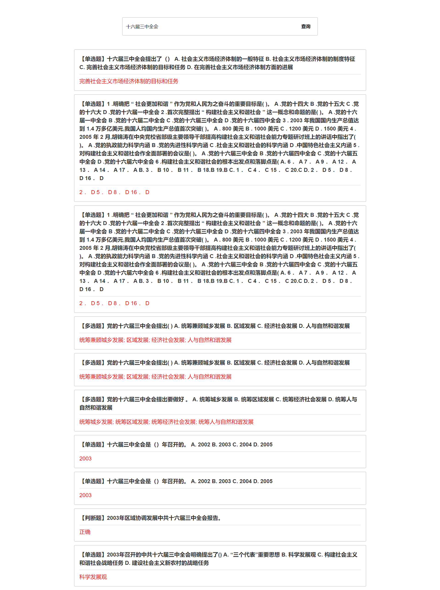

# xxy-web

使用 Vue 构建的 **学小易 APP** Web 端查询工具。

## 说明

本应用不提供注册，请下载 [学小易 APP](https://www.51xuexiaoyi.com/download) 进行注册操作。

本应用会在本地存储登陆成功后的 token，并确保不会上传你的 token 以及账号、密码等信息。

建议在本地构建使用。

```
yarn install
yarn serve
```

另外，请注意甄别其它类似项目，仅能保证该仓库项目的安全性。

请勿用于非法用途，本人不承担任何责任。

## 程序部署

```
// 拉取依赖
yarn install

// 本地调试
yarn serve

// 编译
yarn build
```

## 运行效果

http://localhost:8080/login


http://localhost:8080/


